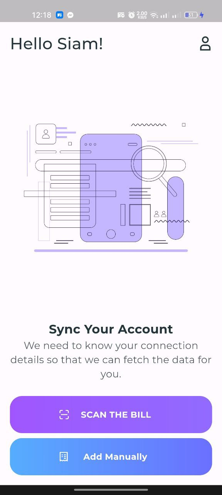
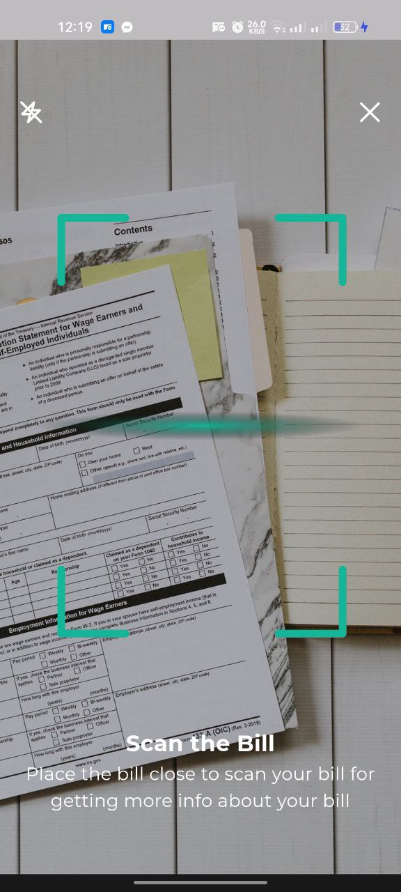
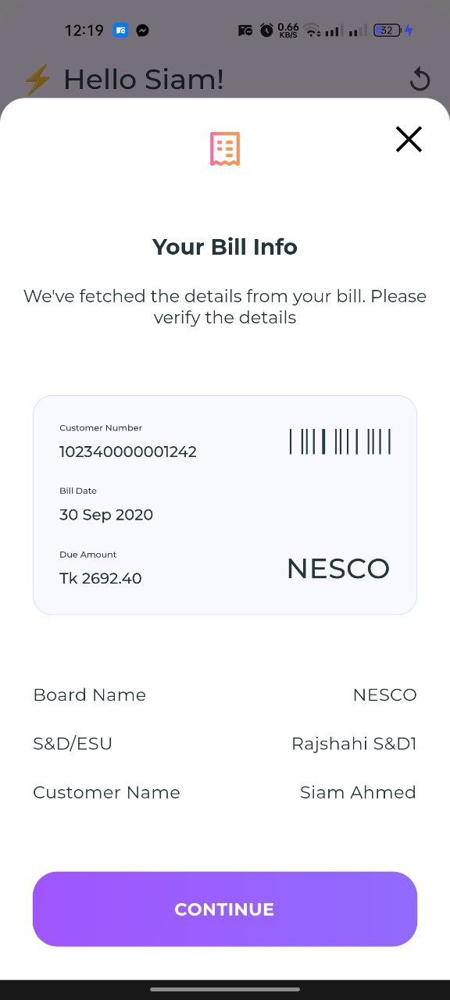
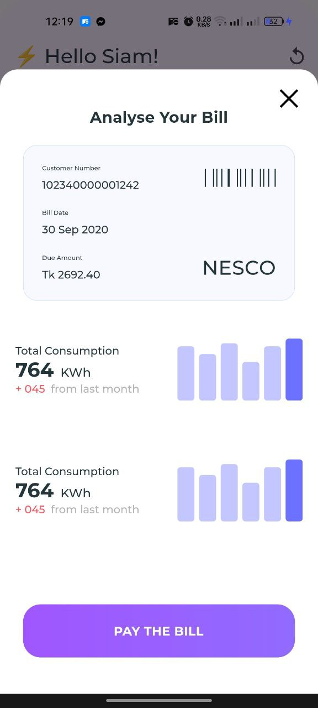
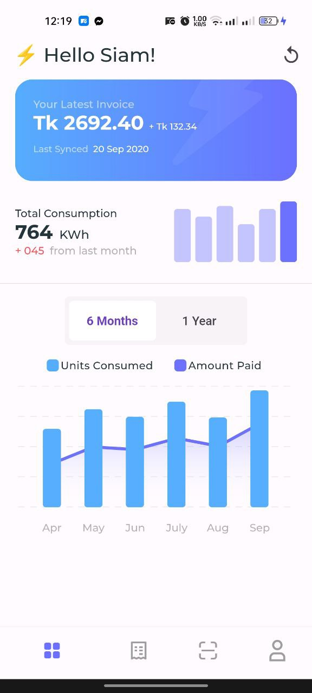
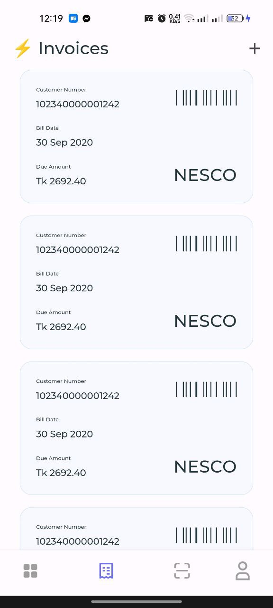

# Task 2: Bill Payment App

A  Flutter mobile demo app for online electricity bill payment.

## Getting Started

This project is a starting point for a Flutter application.

Here is the apk download link for the Flutter project:

- [Bill Payment App.apk](https://github.com/Safius-Sifat/bill_payment_app/releases/download/latext/Bill.payment.app.apk)

## Preview

<table style="width:100%">
  <tr>
    <th>Sign in Screen</th>
    <th>Scan Screen</th>
    <th>Bill info Screen</th>
    <th>Analyse Bill Screen</th>
    <th>Home Screen</th>
    <th>Invoice Screen</th>
   
  </tr>
  <tr>
    <td></td>
    <td></td>
    <td></td>
    <td></td>
    <td></td>
    <td></td>

</table>

Thanks for letting me have the opportunity. Looking forward to hear from you again.
